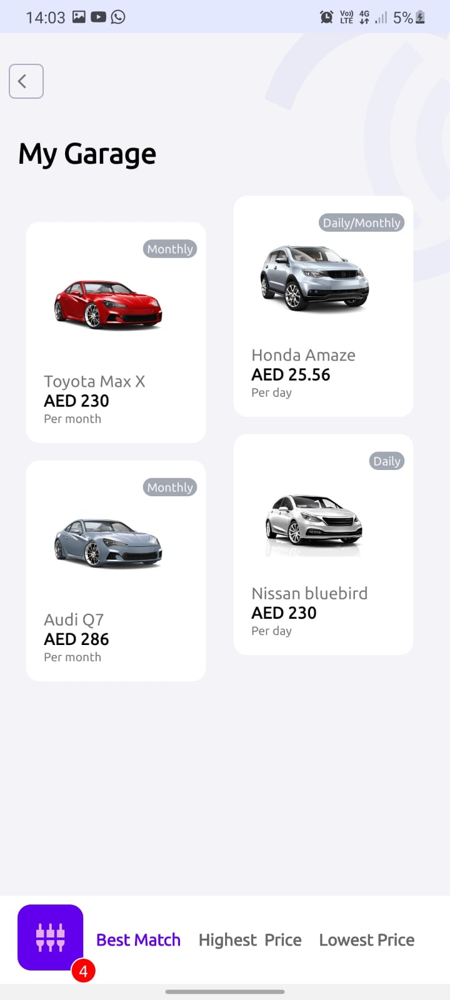
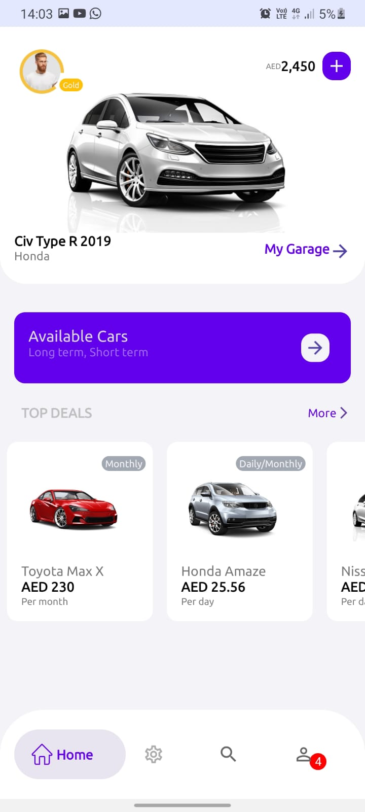
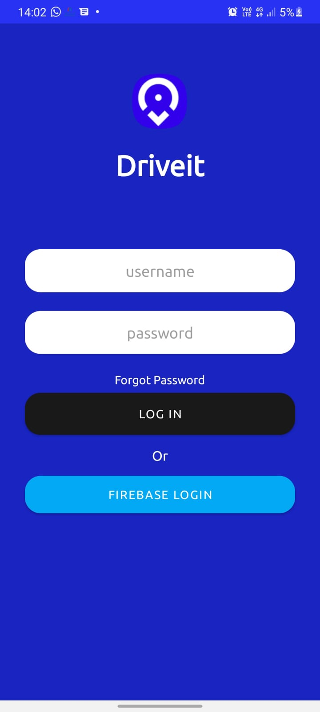

# Driveit -Buupass

**Work In Progress**

Demo project for Senior android Role , part of the app is an implementation of this dribble design [link] (https://dribbble.com/shots/9324676-Car-Rental-app)

**Application Architecture**

The project is architecture in MVVM-modular Clean architure.

# Modules
The application is divided into the following modules (Clean Architecture) forcusing on seperation of Concerns.
## 1 App
This modules has all the view classes and viewmodels that communicate with the repositories in the datasource module.

## 2 data

This module is a data source, it provides data from api call and local database. It is consumed by the viewmodels

## 3 domain

This a java module that has the app use cases and the utility classes that are used in all the modules

**Major libraries Used**

1. Koin -Dependency Injection
2. Retrofit
3. Okhttp
4. RxJava
5. Avatargenerator

* App**

<table>
<tr>
<td>

</td>
<td>

</td>
<td>

</td>
</tr>
</table>

